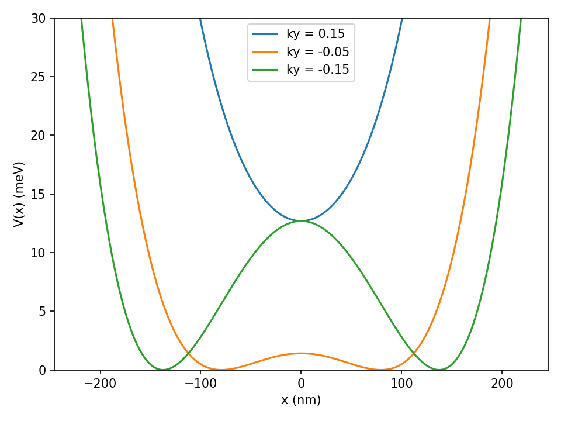
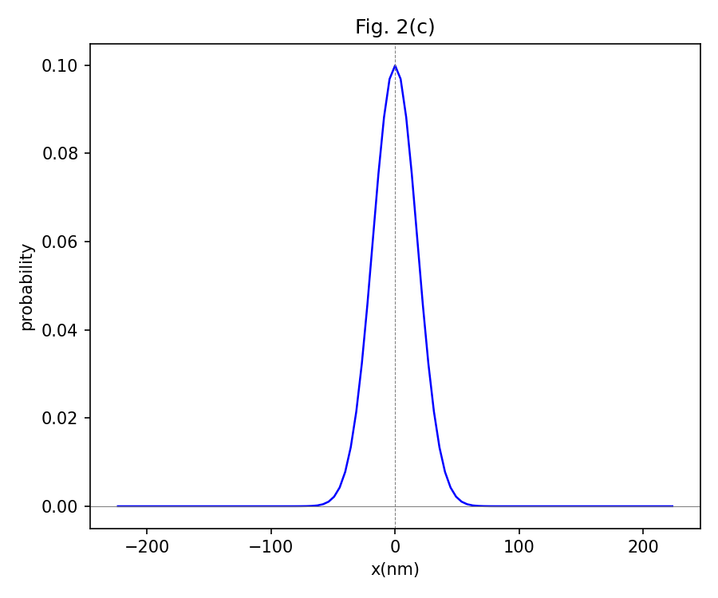
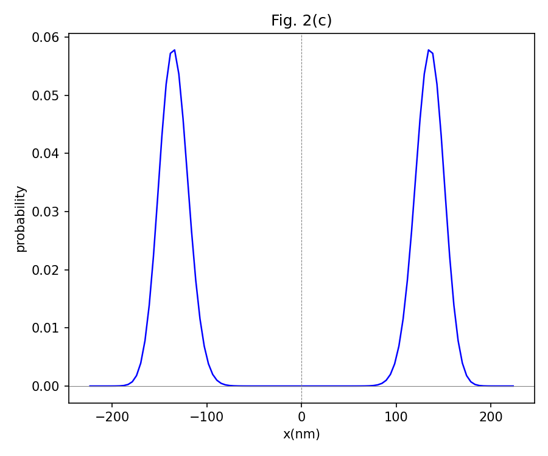
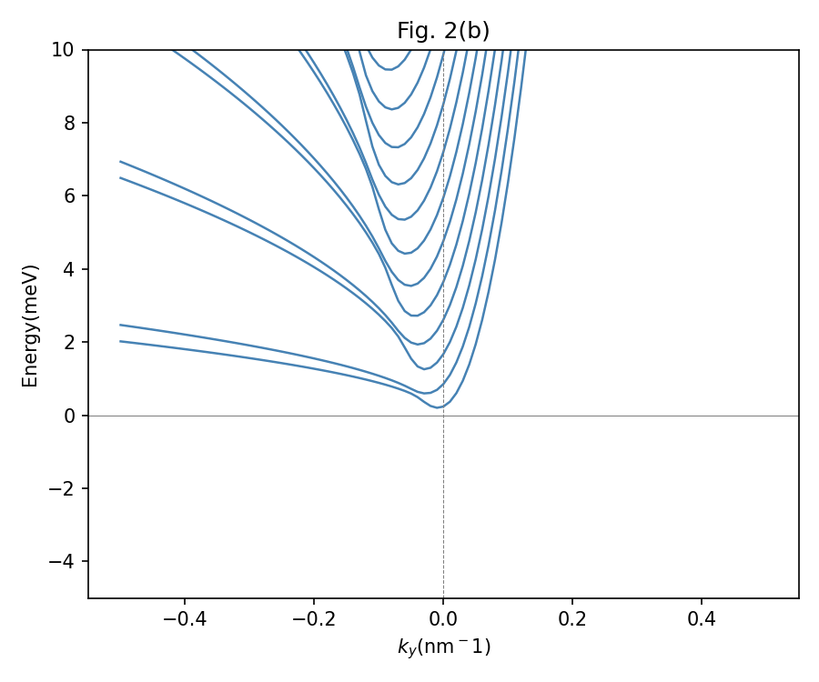
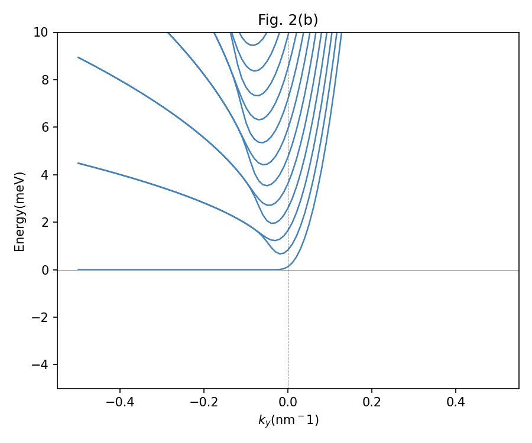
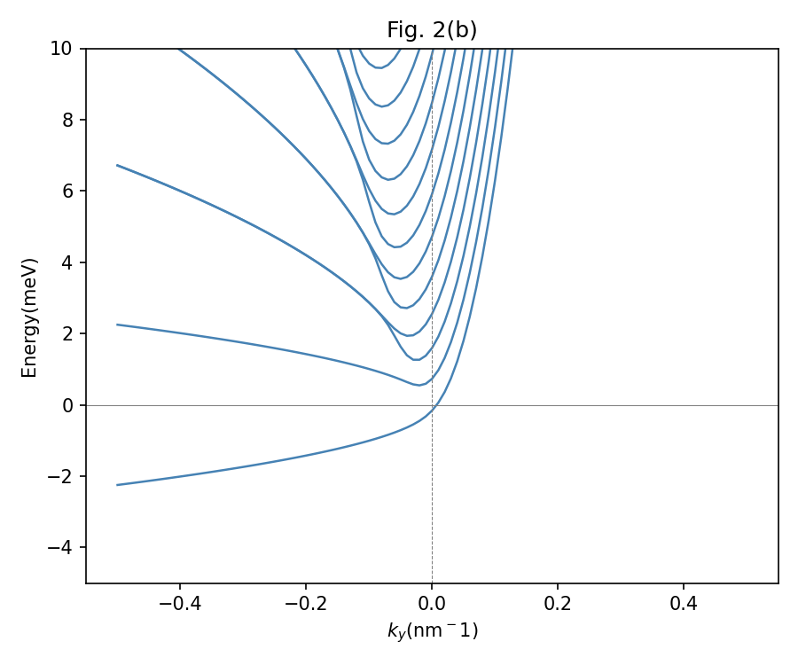
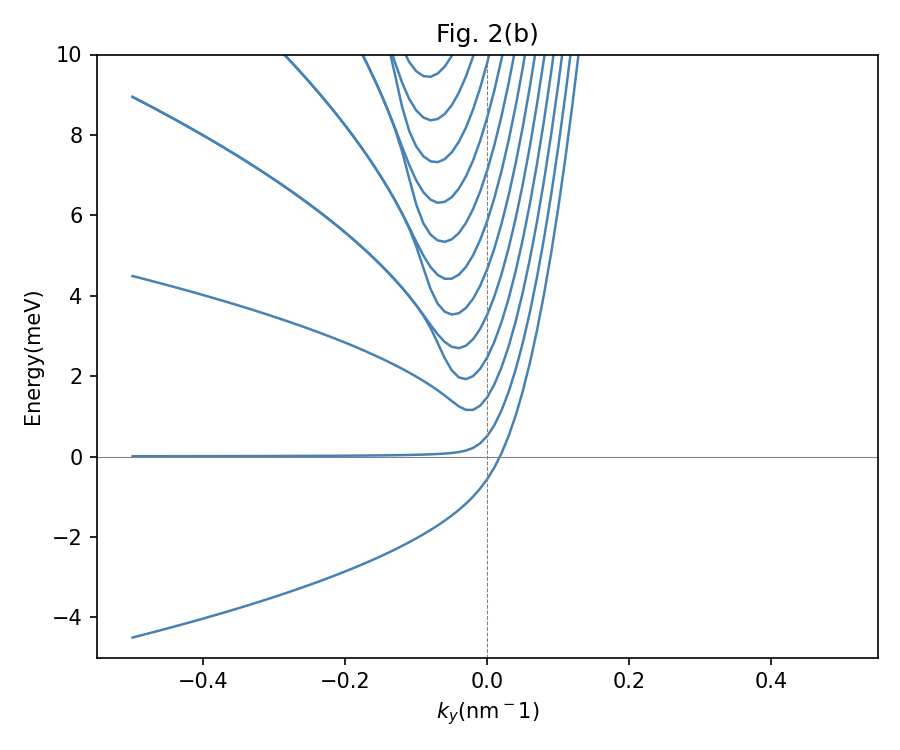

# Nonuniform Magnetic Field — 2DEG Simulator

A Python simulation of 2D electron gases (2DEGs) subjected to a linearly
increasing magnetic-field dipole and a transverse electric field.

Reproduces and extends results from [arXiv:2601.05064](https://arxiv.org/abs/2601.05064).
Built as part of a transition from academic physics to semiconductor/EDA engineering.

## Physics
The system exhibits electrically switchable Landau levels: at discrete values
of the transverse electric field, specific energy bands become completely flat —
a tuneable high-density-of-states condition relevant to quantum Hall devices.

### (1) Effective potential, zero electric field spectrum, and probability density

---

### (2) Energy spectrum under different electric field strengths

The spectrum evolves with electric field, at eVe = 0.5ℏωc and 1.5ℏωc, the first and second bands become completely flat respectively — reproducing Fig. 3 of arXiv:2601.05064.

## How to run
python potential.py      # plots effective potential V(x)
python spectrum.py       # computes and plots energy spectrum E(ky)

## In progress
Time-dependent extension (AC electric field): computing high-order harmonic 
Hall current generation under periodic driving.

## Structure
- `params.py` — physical constants in Hartree atomic units (GaAs/AlGaAs parameters)
- `basis.py` — Hermite function basis, ladder operator matrix elements (x, x², x⁴, p²)
- `hamiltonian.py` — builds the quartic Hamiltonian matrix H(ky, Ve)
- `potential.py` — plots the effective potential V(x) for different ky
- `spectrum.py` — full ky sweep, energy spectrum E(ky)

## Requirements
pip install numpy scipy matplotlib